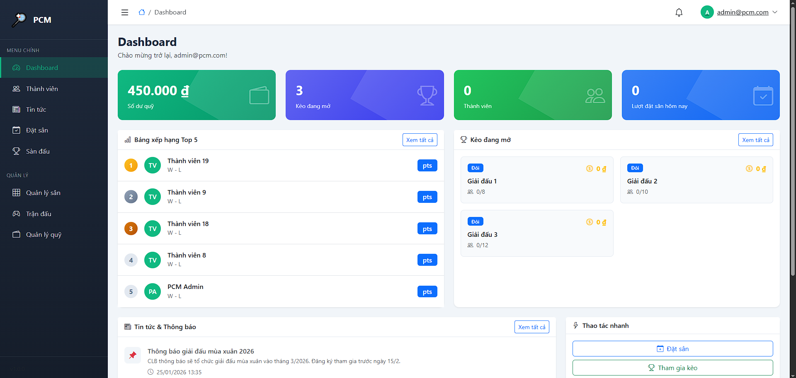
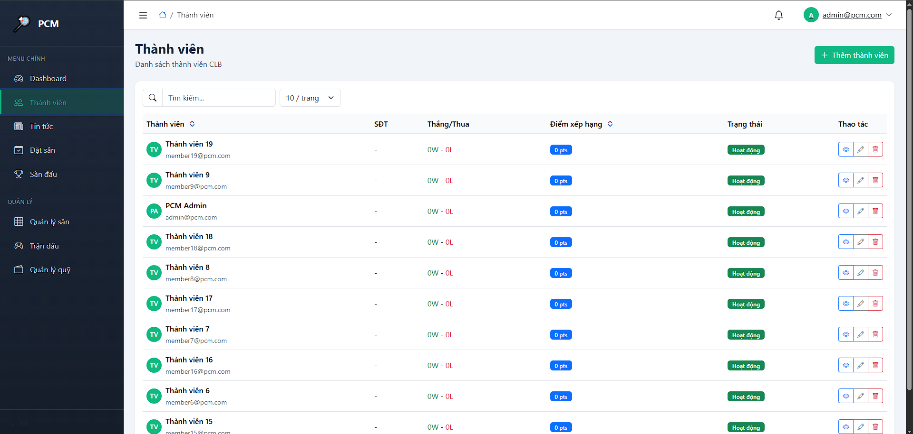
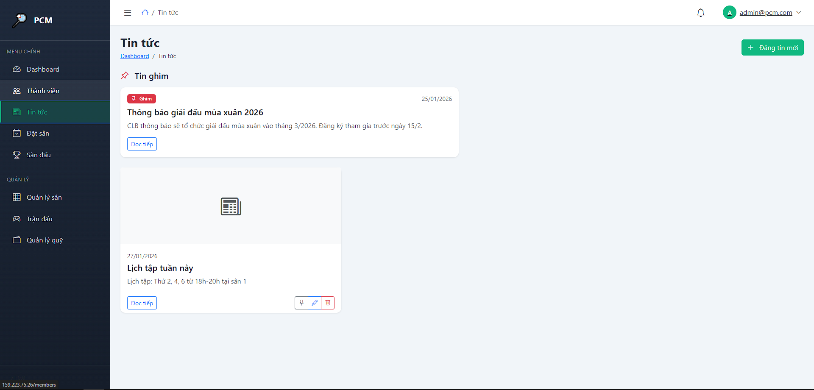
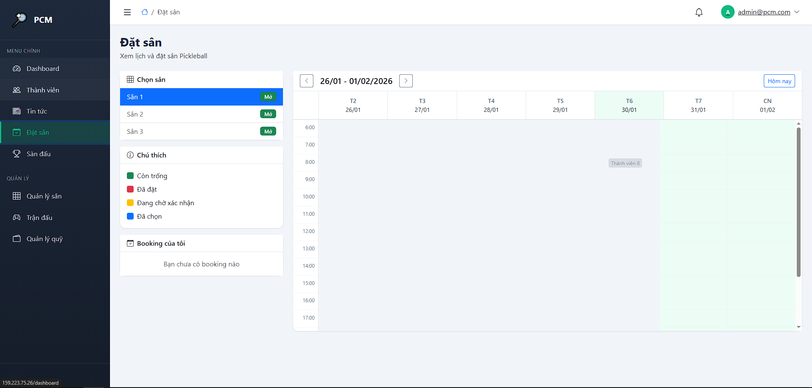
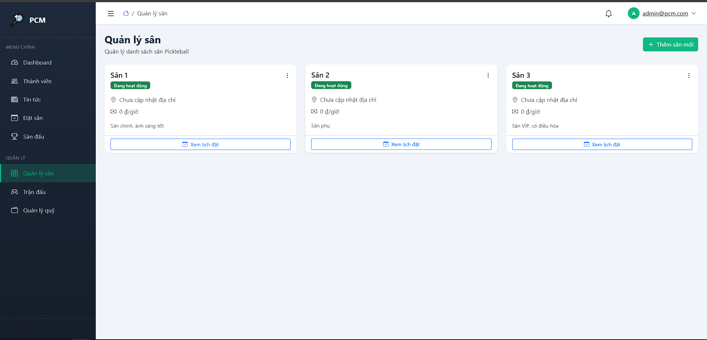
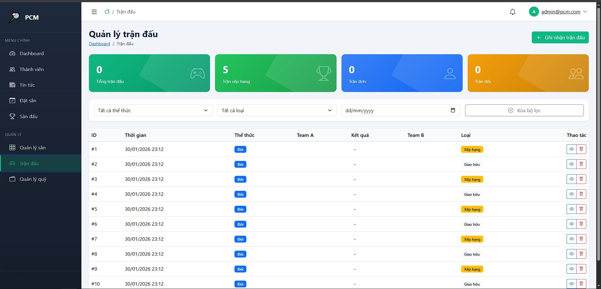
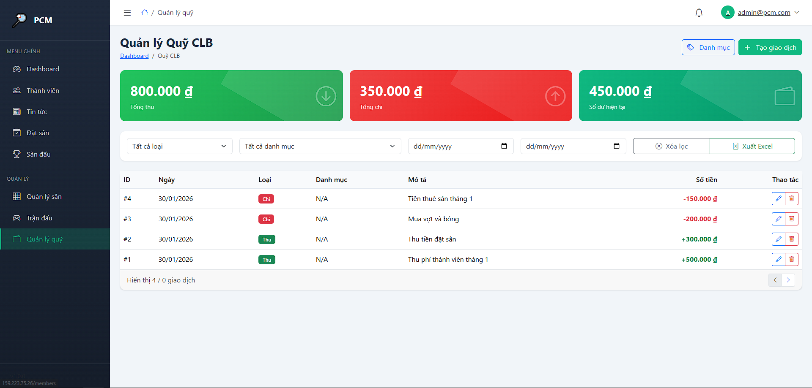

# 🏸 VỢT THỦ PHỐ NÚI - Pickleball Club Management System

<p align="center">
  
  
  
  
</p>

<p align="center">
  <b>Hệ thống quản lý Câu lạc bộ Pickleball toàn diện, hiện đại và chuyên nghiệp</b>
</p>

---

## �‍🎓 Thông tin sinh viên

| Thông tin | Chi tiết |
|-----------|----------|
| **Họ và tên** | Nguyễn Văn Tiến |
| **MSSV** | 1771040025 |
| **Lớp** | KHMT 17-01 |
| **Môn học** | Lập trình Full-stack |
| **Học kỳ** | HK2 - Năm học 2025-2026 |

---

## �📋 Mục lục

1. [Giới thiệu tổng quan](#-giới-thiệu-tổng-quan)
2. [Demo trực tuyến](#-demo-trực-tuyến)
3. [Tính năng chi tiết](#-tính-năng-chi-tiết)
4. [Công nghệ sử dụng](#️-công-nghệ-sử-dụng)
5. [Kiến trúc hệ thống](#-kiến-trúc-hệ-thống)
6. [Cơ sở dữ liệu](#-cơ-sở-dữ-liệu)
7. [API Documentation](#-api-documentation)
8. [Hướng dẫn cài đặt](#-hướng-dẫn-cài-đặt)
9. [Hướng dẫn Deploy](#-hướng-dẫn-deploy)
10. [Tài khoản Demo](#-tài-khoản-demo)
11. [Screenshots](#-screenshots)
12. [Roadmap](#-roadmap)
13. [Đóng góp](#-đóng-góp)
14. [Thông tin liên hệ](#-thông-tin-liên-hệ)

---

## 🎯 Giới thiệu tổng quan

### Về dự án

**Vợt Thủ Phố Núi (PCM - Pickleball Club Management)** là một hệ thống quản lý câu lạc bộ thể thao Pickleball được xây dựng với mục tiêu:

- 🎯 **Số hóa** quy trình quản lý câu lạc bộ thể thao
- 📊 **Tối ưu hóa** việc đặt sân, tổ chức giải đấu
- 💰 **Minh bạch** trong quản lý tài chính câu lạc bộ
- 🏆 **Thúc đẩy** tinh thần thi đấu qua hệ thống xếp hạng

### Pickleball là gì?

Pickleball là môn thể thao kết hợp giữa Tennis, Cầu lông và Bóng bàn. Đây là môn thể thao phát triển nhanh nhất tại Mỹ và đang lan rộng mạnh mẽ tại Việt Nam, đặc biệt thu hút mọi lứa tuổi nhờ:
- Dễ học, dễ chơi
- Sân nhỏ gọn, chi phí thấp
- Tốt cho sức khỏe và giao lưu cộng đồng

### Vấn đề giải quyết

| Vấn đề | Giải pháp của PCM |
|--------|-------------------|
| Đặt sân thủ công, hay trùng lịch | Hệ thống đặt sân trực tuyến với kiểm tra real-time |
| Quản lý thành viên bằng Excel | Database tập trung, tìm kiếm nhanh |
| Không theo dõi được kết quả thi đấu | Ghi nhận trận đấu, thống kê tự động |
| Quỹ CLB không minh bạch | Module tài chính với lịch sử giao dịch chi tiết |
| Khó tổ chức giải đấu | Tạo/quản lý giải đấu, đăng ký online |

---

## 🌐 Demo trực tuyến

| Thành phần | URL | Mô tả |
|------------|-----|-------|
| 🖥️ **Web Application** | `http://159.223.75.26` | Giao diện người dùng Vue.js |
| 🔌 **API Swagger** | `http://159.223.75.26:5000/swagger` | Tài liệu API tương tác |
| 📦 **Source Code** | [GitHub Repository](https://github.com/NVT-Master/PiickerBall) | Mã nguồn dự án |

---

## ✨ Tính năng chi tiết

### 1. 🏠 Dashboard - Tổng quan hệ thống

Dashboard cung cấp cái nhìn tổng quan về hoạt động câu lạc bộ:

```
┌─────────────────────────────────────────────────────────────┐
│                      DASHBOARD                               │
├──────────────┬──────────────┬──────────────┬────────────────┤
│  💰 Số dư quỹ │  🏆 Kèo mở   │  👥 Thành viên │ 📅 Đặt sân    │
│  12,500,000đ │     5        │     25        │   3 hôm nay   │
├──────────────┴──────────────┴──────────────┴────────────────┤
│  📊 BẢNG XẾP HẠNG TOP 5    │  📰 TIN TỨC MỚI NHẤT          │
│  ┌────┬──────────┬───────┐ │  ┌───────────────────────────┐ │
│  │ 🥇 │ Nguyễn A │ 150pt │ │  │ 🏆 Giải Pickleball Xuân   │ │
│  │ 🥈 │ Trần B   │ 120pt │ │  │ 📅 Lịch tập tháng 2       │ │
│  │ 🥉 │ Lê C     │ 110pt │ │  │ 💡 Tips chơi Pickleball   │ │
│  └────┴──────────┴───────┘ │  └───────────────────────────┘ │
└─────────────────────────────────────────────────────────────┘
```

**Tính năng:**
- ✅ Thống kê số dư quỹ câu lạc bộ (Admin)
- ✅ Số lượng giải đấu/thách đấu đang mở
- ✅ Tổng số thành viên hoạt động
- ✅ Lượt đặt sân trong ngày
- ✅ Bảng xếp hạng Top 5 theo điểm ranking
- ✅ Tin tức và thông báo mới nhất
- ✅ Danh sách giải đấu sắp diễn ra

---

### 2. 👥 Quản lý thành viên (Members)

**Thông tin thành viên:**
| Trường | Mô tả |
|--------|-------|
| `FullName` | Họ tên đầy đủ |
| `Email` | Email đăng nhập |
| `PhoneNumber` | Số điện thoại liên hệ |
| `DateOfBirth` | Ngày sinh |
| `JoinDate` | Ngày gia nhập CLB |
| `RankLevel` | Cấp độ xếp hạng (1.0 - 5.0) |
| `TotalMatches` | Tổng số trận đã đấu |
| `WinMatches` | Số trận thắng |
| `IsActive` | Trạng thái hoạt động |

**Tính năng:**
- ✅ Đăng ký tài khoản với xác thực email
- ✅ Đăng nhập/Đăng xuất với JWT Token
- ✅ Xem và cập nhật thông tin cá nhân
- ✅ Danh sách thành viên với phân trang
- ✅ Tìm kiếm thành viên theo tên/email
- ✅ Xem thống kê thi đấu cá nhân
- ✅ Bảng xếp hạng toàn CLB

**Hệ thống Rank Level:**
| Level | Mô tả | Điều kiện |
|-------|-------|-----------|
| 1.0 - 2.0 | Beginner | Mới bắt đầu |
| 2.0 - 3.0 | Intermediate | Nắm cơ bản |
| 3.0 - 4.0 | Advanced | Kỹ thuật tốt |
| 4.0 - 5.0 | Expert | Chuyên nghiệp |

---

### 3. 🎾 Quản lý sân đấu (Courts)

**Thông tin sân:**
```csharp
Court {
    Id: int,
    Name: string,        // "Sân 1", "Sân 2", "Sân 3"
    Description: string, // Mô tả chi tiết
    IsActive: bool       // Trạng thái hoạt động
}
```

**Tính năng:**
- ✅ Danh sách các sân đấu
- ✅ Thông tin chi tiết từng sân
- ✅ Trạng thái hoạt động (bật/tắt)
- ✅ Lịch sử đặt sân theo từng sân

---

### 4. 📅 Đặt sân trực tuyến (Bookings)

Hệ thống đặt sân thông minh, tránh trùng lịch:

```
┌──────────────────────────────────────────────────────────────┐
│                    LỊCH ĐẶT SÂN TUẦN                         │
├──────────┬─────┬─────┬─────┬─────┬─────┬─────┬─────┬────────┤
│ Giờ      │ T2  │ T3  │ T4  │ T5  │ T6  │ T7  │ CN  │        │
├──────────┼─────┼─────┼─────┼─────┼─────┼─────┼─────┼────────┤
│ 06:00-08:00│ 🟢  │ 🔴  │ 🟢  │ 🟢  │ 🟡  │ 🔴  │ 🔴  │ Sân 1  │
│ 08:00-10:00│ 🟢  │ 🟢  │ 🔴  │ 🟢  │ 🟢  │ 🟡  │ 🔴  │ Sân 2  │
│ ...      │     │     │     │     │     │     │     │        │
└──────────┴─────┴─────┴─────┴─────┴─────┴─────┴─────┴────────┘
🟢 Trống  🔴 Đã đặt  🟡 Đang chờ
```

**Trạng thái Booking:**
| Status | Mô tả |
|--------|-------|
| `Pending` | Đang chờ xác nhận |
| `Confirmed` | Đã xác nhận |
| `Cancelled` | Đã hủy |
| `Completed` | Đã hoàn thành |

**Tính năng:**
- ✅ Đặt sân với chọn ngày giờ
- ✅ Kiểm tra khung giờ còn trống (API `available-slots`)
- ✅ Xem lịch đặt sân theo tuần (Calendar View)
- ✅ Quản lý booking cá nhân
- ✅ Hủy booking khi cần
- ✅ Ghi chú cho mỗi lần đặt

---

### 5. 🏆 Giải đấu & Thách đấu (Challenges)

**Loại hình thi đấu:**
| Type | Mô tả |
|------|-------|
| `Tournament` | Giải đấu chính thức |
| `FriendlyMatch` | Đấu giao hữu |
| `RankedMatch` | Đấu xếp hạng |

**Định dạng trận đấu:**
| Format | Mô tả |
|--------|-------|
| `Singles` | Đấu đơn (1 vs 1) |
| `Doubles` | Đấu đôi (2 vs 2) |

**Trạng thái giải đấu:**
```
Open → Ongoing → Completed
  ↓
Cancelled
```

**Tính năng:**
- ✅ Tạo giải đấu mới với đầy đủ thông tin
- ✅ Cấu hình phí tham gia và giải thưởng
- ✅ Giới hạn số người tham gia
- ✅ Đăng ký tham gia giải
- ✅ Chọn đội và đồng đội (Doubles)
- ✅ Theo dõi danh sách người tham gia
- ✅ Cập nhật trạng thái giải đấu
- ✅ Xác định người/đội chiến thắng

---

### 6. 🎯 Quản lý trận đấu (Matches)

**Cấu trúc trận đấu:**
```
Match {
    Team 1: Player1 + Player2 (optional)
    Team 2: Player1 + Player2 (optional)
    WinningSide: Team1 | Team2 | Draw | None
    IsRanked: true/false
    MatchFormat: Singles | Doubles
}
```

**Tính năng:**
- ✅ Ghi nhận kết quả trận đấu
- ✅ Hỗ trợ đấu đơn và đấu đôi
- ✅ Phân biệt trận Ranked và Friendly
- ✅ Liên kết với giải đấu
- ✅ Tự động cập nhật thống kê thành viên

---

### 7. 💰 Quản lý tài chính (Transactions)

**Danh mục thu chi:**

| Loại | Danh mục | Mô tả |
|------|----------|-------|
| 📈 **Thu** | MembershipFee | Phí thành viên |
| 📈 **Thu** | BookingFee | Phí đặt sân |
| 📈 **Thu** | Sponsorship | Tài trợ |
| 📈 **Thu** | TournamentPrize | Tiền giải đấu |
| 📈 **Thu** | OtherIncome | Thu khác |
| 📉 **Chi** | EquipmentPurchase | Mua thiết bị |
| 📉 **Chi** | CourtMaintenance | Chi phí sân |
| 📉 **Chi** | PrizeMoney | Tiền thưởng |
| 📉 **Chi** | ClubActivities | Hoạt động CLB |
| 📉 **Chi** | OtherExpense | Chi khác |

**Tính năng:**
- ✅ Tạo giao dịch thu/chi
- ✅ Phân loại theo danh mục
- ✅ Lịch sử giao dịch với phân trang
- ✅ Ghi chú chi tiết mỗi giao dịch
- ✅ Theo dõi người tạo giao dịch
- ✅ Báo cáo tổng hợp tài chính
- ✅ Cảnh báo khi số dư âm

---

### 8. 📰 Tin tức & Thông báo (News)

**Tính năng:**
- ✅ Đăng tin tức với tiêu đề và nội dung
- ✅ Hỗ trợ hình ảnh minh họa
- ✅ Ghim tin quan trọng lên đầu
- ✅ Phân trang danh sách tin
- ✅ Sắp xếp theo thời gian
- ✅ Chỉnh sửa và xóa tin

---

## 🛠️ Công nghệ sử dụng

### Backend Stack

| Công nghệ | Phiên bản | Mục đích |
|-----------|-----------|----------|
| ASP.NET Core | 8.0 | Web API Framework |
| Entity Framework Core | 9.0.1 | ORM, Code-First |
| SQL Server | 2019+ | Database |
| ASP.NET Identity | 8.0 | Authentication |
| JWT Bearer | - | Token-based Auth |
| Swagger/OpenAPI | - | API Documentation |

### Frontend Stack

| Công nghệ | Phiên bản | Mục đích |
|-----------|-----------|----------|
| Vue.js | 3.4.x | Frontend Framework |
| Vite | 6.4.x | Build Tool |
| Pinia | 2.1.x | State Management |
| Vue Router | 4.3.x | Routing |
| Axios | 1.6.x | HTTP Client |
| Bootstrap | 5.3.x | CSS Framework |
| Bootstrap Icons | 1.11.x | Icon Library |
| Chart.js | 4.4.x | Data Visualization |
| Day.js | 1.11.x | Date Manipulation |

### DevOps & Deployment

| Công nghệ | Mục đích |
|-----------|----------|
| Docker | Containerization |
| Docker Compose | Multi-container |
| Nginx | Reverse Proxy |
| DigitalOcean | Cloud Hosting |
| GitHub | Source Control |

---

## 🏗 Kiến trúc hệ thống

### Tổng quan kiến trúc

```
┌─────────────────────────────────────────────────────────────────┐
│                         CLIENT LAYER                             │
│  ┌─────────────────┐  ┌─────────────────┐  ┌─────────────────┐  │
│  │   Web Browser   │  │  Mobile App     │  │   API Clients   │  │
│  │   (Vue.js SPA)  │  │  (Future)       │  │   (Swagger)     │  │
│  └────────┬────────┘  └────────┬────────┘  └────────┬────────┘  │
└───────────┼─────────────────────┼─────────────────────┼─────────┘
            │                     │                     │
            │              HTTPS/REST API               │
            │                     │                     │
┌───────────▼─────────────────────▼─────────────────────▼─────────┐
│                      API GATEWAY (Nginx)                         │
│  ┌─────────────────────────────────────────────────────────────┐│
│  │  Reverse Proxy │ SSL Termination │ Load Balancing │ Caching ││
│  └─────────────────────────────────────────────────────────────┘│
└─────────────────────────────┬───────────────────────────────────┘
                              │
┌─────────────────────────────▼───────────────────────────────────┐
│                    APPLICATION LAYER                             │
│  ┌─────────────────────────────────────────────────────────────┐│
│  │                   ASP.NET Core 8.0 API                      ││
│  │  ┌──────────────┐ ┌──────────────┐ ┌──────────────────────┐ ││
│  │  │ Controllers  │ │   Services   │ │   Authentication     │ ││
│  │  │  - Auth      │ │   (Business  │ │   - JWT Bearer       │ ││
│  │  │  - Members   │ │    Logic)    │ │   - Identity         │ ││
│  │  │  - Courts    │ │              │ │   - Roles (Admin,    │ ││
│  │  │  - Bookings  │ │              │ │     Member)          │ ││
│  │  │  - Challenges│ │              │ │                      │ ││
│  │  │  - Matches   │ │              │ │                      │ ││
│  │  │  - News      │ │              │ │                      │ ││
│  │  │  - Dashboard │ │              │ │                      │ ││
│  │  └──────────────┘ └──────────────┘ └──────────────────────┘ ││
│  └─────────────────────────────────────────────────────────────┘│
└─────────────────────────────┬───────────────────────────────────┘
                              │
┌─────────────────────────────▼───────────────────────────────────┐
│                      DATA ACCESS LAYER                           │
│  ┌─────────────────────────────────────────────────────────────┐│
│  │              Entity Framework Core 9.0 (ORM)                ││
│  │  ┌──────────────┐ ┌──────────────┐ ┌──────────────────────┐ ││
│  │  │   DbContext  │ │  Migrations  │ │   DbInitializer      │ ││
│  │  │              │ │  (Code-First)│ │   (Seed Data)        │ ││
│  │  └──────────────┘ └──────────────┘ └──────────────────────┘ ││
│  └─────────────────────────────────────────────────────────────┘│
└─────────────────────────────┬───────────────────────────────────┘
                              │
┌─────────────────────────────▼───────────────────────────────────┐
│                      DATABASE LAYER                              │
│  ┌─────────────────────────────────────────────────────────────┐│
│  │                    SQL Server 2019+                         ││
│  │  Tables: AspNetUsers, AspNetRoles, Members, Courts,         ││
│  │          Bookings, Challenges, Participants, Matches,        ││
│  │          WalletTransactions, News                           ││
│  └─────────────────────────────────────────────────────────────┘│
└─────────────────────────────────────────────────────────────────┘
```

### Cấu trúc thư mục chi tiết

```
📦 Tuan7/
├── 📁 PCM.Api/                    # Backend Solution
│   └── 📁 PCM.Api/                # Main API Project
│       ├── 📁 Controllers/        # API Controllers
│       │   ├── AuthController.cs
│       │   ├── MembersController.cs
│       │   ├── CourtsController.cs
│       │   ├── BookingsController.cs
│       │   ├── ChallengesController.cs
│       │   ├── ParticipantsController.cs
│       │   ├── MatchesController.cs
│       │   ├── TransactionsController.cs
│       │   ├── NewsController.cs
│       │   └── DashboardController.cs
│       ├── 📁 Data/               # Database Layer
│       │   ├── ApplicationDbContext.cs
│       │   └── DbInitializer.cs
│       ├── 📁 DTOs/               # Data Transfer Objects
│       │   ├── 📁 Bookings/
│       │   └── 📁 Login/
│       ├── 📁 Enums/              # Enumerations
│       │   ├── BookingStatus.cs
│       │   ├── ChallengeStatus.cs
│       │   ├── ChallengeType.cs
│       │   ├── GameMode.cs
│       │   ├── MatchFormat.cs
│       │   ├── TransactionType.cs
│       │   └── WinningSide.cs
│       ├── 📁 Models/             # Domain Models
│       │   ├── 📁 Members/
│       │   ├── 📁 Courts/
│       │   ├── 📁 Bookings/
│       │   ├── 📁 Challenges/
│       │   ├── 📁 Matches/
│       │   ├── News.cs
│       │   ├── Wallet.cs
│       │   └── WalletTransaction.cs
│       ├── 📁 Migrations/         # EF Migrations
│       ├── 📁 Services/           # Business Logic
│       ├── Dockerfile
│       ├── Program.cs
│       ├── appsettings.json
│       └── appsettings.Production.json
│
├── 📁 PCM.Web/                    # Frontend Project
│   ├── 📁 src/
│   │   ├── 📁 api/               # API Service Calls
│   │   ├── 📁 assets/            # Static Assets
│   │   ├── 📁 components/        # Reusable Components
│   │   ├── 📁 config/            # Configuration
│   │   ├── 📁 layouts/           # Layout Components
│   │   ├── 📁 router/            # Vue Router
│   │   ├── 📁 stores/            # Pinia Stores
│   │   ├── 📁 views/             # Page Views
│   │   │   ├── 📁 auth/
│   │   │   ├── 📁 members/
│   │   │   ├── 📁 courts/
│   │   │   ├── 📁 bookings/
│   │   │   ├── 📁 challenges/
│   │   │   ├── 📁 matches/
│   │   │   ├── 📁 transactions/
│   │   │   ├── 📁 news/
│   │   │   ├── 📁 profile/
│   │   │   └── Dashboard.vue
│   │   ├── App.vue
│   │   └── main.js
│   ├── 📁 public/
│   ├── Dockerfile
│   ├── package.json
│   └── vite.config.js
│
├── 📁 deploy/                     # Deployment Configs
│   └── nginx-pcm.conf
├── docker-compose.yml
├── deploy-do.sh                   # DigitalOcean Deploy Script
├── nginx-vps.conf
├── kestrel-pcmapi.service
└── README.md
```

---

## 🗄 Cơ sở dữ liệu

### Entity Relationship Diagram (ERD)

```
┌───────────────────┐       ┌───────────────────┐
│   AspNetUsers     │       │   AspNetRoles     │
│───────────────────│       │───────────────────│
│ Id (PK)           │◄──────│ Id (PK)           │
│ UserName          │       │ Name              │
│ Email             │       └───────────────────┘
│ PasswordHash      │
│ ...               │
└─────────┬─────────┘
          │
          │ 1:1
          ▼
┌───────────────────┐       ┌───────────────────┐
│   025_Members     │       │   025_Courts      │
│───────────────────│       │───────────────────│
│ Id (PK)           │       │ Id (PK)           │
│ UserId (FK)       │       │ Name              │
│ FullName          │       │ Description       │
│ Email             │       │ IsActive          │
│ PhoneNumber       │       └─────────┬─────────┘
│ DateOfBirth       │                 │
│ JoinDate          │                 │
│ RankLevel         │                 │
│ TotalMatches      │                 │
│ WinMatches        │                 │
│ IsActive          │                 │
└─────────┬─────────┘                 │
          │                           │
          │ 1:N                       │ 1:N
          ▼                           ▼
┌───────────────────┐       ┌───────────────────┐
│  025_Bookings     │       │  025_Challenges   │
│───────────────────│       │───────────────────│
│ Id (PK)           │       │ Id (PK)           │
│ CourtId (FK)──────┼───────│ Title             │
│ MemberId (FK)     │       │ Description       │
│ StartTime         │       │ ChallengeType     │
│ EndTime           │       │ MatchFormat       │
│ Status            │       │ Status            │
│ Notes             │       │ MaxParticipants   │
│ CreatedDate       │       │ EntryFee          │
└───────────────────┘       │ PrizeAmount       │
                            │ CreatedBy (FK)    │
                            │ WinnerId (FK)     │
                            │ ScheduledDate     │
                            └─────────┬─────────┘
                                      │
                                      │ 1:N
                                      ▼
                            ┌───────────────────┐
                            │ 025_Participants  │
                            │───────────────────│
                            │ Id (PK)           │
                            │ ChallengeId (FK)  │
                            │ MemberId (FK)     │
                            │ TeamNumber        │
                            │ PartnerId (FK)    │
                            │ JoinedAt          │
                            └───────────────────┘

┌───────────────────┐       ┌───────────────────┐
│   025_Matches     │       │ 025_WalletTrans.  │
│───────────────────│       │───────────────────│
│ Id (PK)           │       │ Id (PK)           │
│ Date              │       │ MemberId (FK)     │
│ IsRanked          │       │ Amount            │
│ ChallengeId (FK)  │       │ Type              │
│ MatchFormat       │       │ Category          │
│ Team1_Player1Id   │       │ Description       │
│ Team1_Player2Id   │       │ CreatedAt         │
│ Team2_Player1Id   │       │ CreatedBy         │
│ Team2_Player2Id   │       └───────────────────┘
│ WinningSide       │
└───────────────────┘       ┌───────────────────┐
                            │    025_News       │
                            │───────────────────│
                            │ Id (PK)           │
                            │ Title             │
                            │ Content           │
                            │ ImageUrl          │
                            │ IsPinned          │
                            │ CreatedAt         │
                            │ UpdatedAt         │
                            │ AuthorId          │
                            └───────────────────┘
```

---

## 📡 API Documentation

### Authentication Flow

```
┌──────────┐          ┌──────────┐          ┌──────────┐
│  Client  │          │   API    │          │ Database │
└────┬─────┘          └────┬─────┘          └────┬─────┘
     │                     │                     │
     │  POST /api/auth/login                     │
     │  {email, password}  │                     │
     │────────────────────►│                     │
     │                     │  Validate User      │
     │                     │────────────────────►│
     │                     │◄────────────────────│
     │                     │  Generate JWT       │
     │  { token, user }    │                     │
     │◄────────────────────│                     │
     │                     │                     │
     │  GET /api/members   │                     │
     │  Authorization: Bearer {token}            │
     │────────────────────►│                     │
     │                     │  Validate Token     │
     │                     │  Query Data         │
     │                     │────────────────────►│
     │  { data }           │◄────────────────────│
     │◄────────────────────│                     │
     │                     │                     │
```

### API Endpoints Summary

#### 🔐 Authentication
| Method | Endpoint | Description | Auth |
|--------|----------|-------------|------|
| POST | `/api/auth/register` | Đăng ký tài khoản | ❌ |
| POST | `/api/auth/login` | Đăng nhập | ❌ |
| GET | `/api/auth/me` | Thông tin user hiện tại | ✅ |

#### 👥 Members
| Method | Endpoint | Description | Auth |
|--------|----------|-------------|------|
| GET | `/api/members` | Danh sách thành viên | ✅ |
| GET | `/api/members/{id}` | Chi tiết thành viên | ✅ |
| PUT | `/api/members/{id}` | Cập nhật thành viên | ✅ |
| GET | `/api/members/leaderboard` | Bảng xếp hạng | ✅ |

#### 🎾 Courts
| Method | Endpoint | Description | Auth |
|--------|----------|-------------|------|
| GET | `/api/courts` | Danh sách sân | ✅ |
| GET | `/api/courts/{id}` | Chi tiết sân | ✅ |

#### 📅 Bookings
| Method | Endpoint | Description | Auth |
|--------|----------|-------------|------|
| GET | `/api/bookings` | Tất cả bookings | ✅ |
| POST | `/api/bookings` | Tạo booking mới | ✅ |
| GET | `/api/bookings/my-bookings` | Booking của tôi | ✅ |
| GET | `/api/bookings/available-slots` | Khung giờ trống | ✅ |
| GET | `/api/bookings/calendar` | Lịch theo tuần | ✅ |
| PUT | `/api/bookings/{id}/cancel` | Hủy booking | ✅ |

#### 🏆 Challenges
| Method | Endpoint | Description | Auth |
|--------|----------|-------------|------|
| GET | `/api/challenges` | Danh sách giải đấu | ✅ |
| POST | `/api/challenges` | Tạo giải đấu | ✅ Admin |
| GET | `/api/challenges/{id}` | Chi tiết giải đấu | ✅ |
| PUT | `/api/challenges/{id}` | Cập nhật giải đấu | ✅ Admin |
| POST | `/api/challenges/{id}/join` | Tham gia giải đấu | ✅ |

#### 🎯 Matches
| Method | Endpoint | Description | Auth |
|--------|----------|-------------|------|
| GET | `/api/matches` | Danh sách trận đấu | ✅ |
| POST | `/api/matches` | Ghi nhận trận đấu | ✅ |
| GET | `/api/matches/{id}` | Chi tiết trận đấu | ✅ |

#### 💰 Transactions
| Method | Endpoint | Description | Auth |
|--------|----------|-------------|------|
| GET | `/api/transactions` | Lịch sử giao dịch | ✅ |
| POST | `/api/transactions` | Tạo giao dịch | ✅ Admin |
| GET | `/api/transaction-categories` | Danh mục thu chi | ✅ |

#### 📰 News
| Method | Endpoint | Description | Auth |
|--------|----------|-------------|------|
| GET | `/api/news` | Danh sách tin tức | ✅ |
| POST | `/api/news` | Đăng tin mới | ✅ Admin |
| GET | `/api/news/{id}` | Chi tiết tin | ✅ |
| PUT | `/api/news/{id}` | Sửa tin | ✅ Admin |
| DELETE | `/api/news/{id}` | Xóa tin | ✅ Admin |

#### 📊 Dashboard
| Method | Endpoint | Description | Auth |
|--------|----------|-------------|------|
| GET | `/api/dashboard/stats` | Thống kê tổng quan | ✅ |
| GET | `/api/dashboard/treasury` | Số dư quỹ | ✅ Admin |

---

## 🚀 Hướng dẫn cài đặt

### Yêu cầu hệ thống

| Component | Minimum | Recommended |
|-----------|---------|-------------|
| OS | Windows 10 / Ubuntu 20.04 | Windows 11 / Ubuntu 22.04 |
| RAM | 4 GB | 8 GB |
| Disk | 10 GB | 20 GB |
| .NET SDK | 8.0 | 8.0 LTS |
| Node.js | 18.x | 20.x LTS |
| SQL Server | 2019 Express | 2022 |

### Cài đặt Backend

```bash
# 1. Clone repository
git clone https://github.com/NVT-Master/PiickerBall.git
cd PiickerBall

# 2. Di chuyển vào thư mục Backend
cd PCM.Api/PCM.Api

# 3. Cấu hình Connection String
# Mở appsettings.json và sửa:
{
  "ConnectionStrings": {
    "DefaultConnection": "Server=YOUR_SERVER;Database=PCM_DB;Trusted_Connection=True;TrustServerCertificate=True"
  }
}

# 4. Restore packages
dotnet restore

# 5. Chạy migrations
dotnet ef database update

# 6. Chạy Backend
dotnet run

# Backend sẽ chạy tại: http://localhost:5003
# Swagger UI: http://localhost:5003/swagger
```

### Cài đặt Frontend

```bash
# 1. Di chuyển vào thư mục Frontend
cd PCM.Web

# 2. Cài đặt dependencies
npm install

# 3. Cấu hình API URL (src/config/app.config.js)
export const API_BASE_URL = 'http://localhost:5003/api'

# 4. Chạy Development Server
npm run dev

# Frontend sẽ chạy tại: http://localhost:5173
```

---

## 🐳 Hướng dẫn Deploy

### Deploy với Docker Compose

```bash
# 1. Tạo file .env
cp .env.example .env
# Sửa SA_PASSWORD trong .env

# 2. Build và chạy
docker compose build
docker compose up -d

# 3. Kiểm tra
docker compose ps
docker compose logs -f api

# API sẽ chạy tại: http://localhost:8080
```

### Deploy lên DigitalOcean

```bash
# 1. Tạo Droplet Ubuntu 22.04

# 2. SSH vào server
ssh root@YOUR_IP

# 3. Upload và chạy script
chmod +x deploy-do.sh
./deploy-do.sh

# 4. Cấu hình Nginx (optional)
cp deploy/nginx-pcm.conf /etc/nginx/sites-available/pcm
ln -s /etc/nginx/sites-available/pcm /etc/nginx/sites-enabled/
nginx -t
systemctl reload nginx

# 5. SSL với Certbot (optional)
certbot --nginx -d yourdomain.com
```

---

## 🔑 Tài khoản Demo

### Admin Account
| Field | Value |
|-------|-------|
| Email | `admin@pcm.com` |
| Password | `Admin@123` |
| Role | Admin |

### Member Accounts
| Email | Password | Note |
|-------|----------|------|
| `user@pcm.com` | `User@123` | Sample member |


---

## 📸 Screenshots









### Dashboard
```
┌────────────────────────────────────────────────────────────┐
│ 🏠 Dashboard           [Chào mừng, Admin!]      [Logout]   │
├────────────────────────────────────────────────────────────┤
│ ┌──────────┐ ┌──────────┐ ┌──────────┐ ┌──────────┐       │
│ │💰12.5M   │ │ 🏆 5     │ │ 👥 25    │ │ 📅 3     │       │
│ │ Số dư    │ │ Kèo mở   │ │ Thành    │ │ Đặt sân  │       │
│ │   quỹ    │ │          │ │   viên   │ │ hôm nay  │       │
│ └──────────┘ └──────────┘ └──────────┘ └──────────┘       │
│                                                            │
│ ┌─────────────────────┐ ┌────────────────────────────┐    │
│ │ 📊 Top 5 Ranking    │ │ 📰 Tin tức                 │    │
│ │ 1. Nguyễn Văn A     │ │ • Giải Pickleball Xuân    │    │
│ │ 2. Trần Văn B       │ │ • Lịch tập tháng 2        │    │
│ │ 3. Lê Thị C         │ │ • Tips cải thiện serve    │    │
│ └─────────────────────┘ └────────────────────────────┘    │
└────────────────────────────────────────────────────────────┘
```

### Đặt sân
```
┌────────────────────────────────────────────────────────────┐
│ 📅 Đặt sân                              [+ Đặt sân mới]    │
├────────────────────────────────────────────────────────────┤
│ ┌──────────────────────────────────────────────────────┐  │
│ │ Lịch tuần: 27/01 - 02/02/2026          [◄] [Hôm nay] [►]│
│ ├──────┬─────┬─────┬─────┬─────┬─────┬─────┬─────┬────┤  │
│ │ Giờ  │ T2  │ T3  │ T4  │ T5  │ T6  │ T7  │ CN  │Sân │  │
│ ├──────┼─────┼─────┼─────┼─────┼─────┼─────┼─────┼────┤  │
│ │06-08 │ 🟢  │ 🔴  │ 🟢  │ 🟢  │ 🟡  │ 🔴  │ 🔴  │ 1  │  │
│ │08-10 │ 🟢  │ 🟢  │ 🔴  │ 🟢  │ 🟢  │ 🟡  │ 🔴  │ 2  │  │
│ │10-12 │ 🟡  │ 🟢  │ 🟢  │ 🔴  │ 🟢  │ 🟢  │ 🟡  │ 3  │  │
│ └──────┴─────┴─────┴─────┴─────┴─────┴─────┴─────┴────┘  │
│ 🟢 Trống   🔴 Đã đặt   🟡 Đang chờ                        │
└────────────────────────────────────────────────────────────┘
```

---

## 🗺 Roadmap

### Đã hoàn thành ✅
- [x] Hệ thống Authentication (JWT)
- [x] Quản lý thành viên
- [x] Quản lý sân đấu
- [x] Đặt sân trực tuyến
- [x] Giải đấu & Thách đấu
- [x] Ghi nhận trận đấu
- [x] Quản lý tài chính
- [x] Tin tức & Thông báo
- [x] Dashboard thống kê
- [x] Docker deployment

### Đang phát triển 🚧
- [ ] Thông báo email
- [ ] Payment gateway
- [ ] Mobile responsive

### Kế hoạch tương lai 📋
- [ ] Mobile App (Flutter)
- [ ] Live scoring system
- [ ] Tournament bracket
- [ ] Chat/Messaging
- [ ] Booking recurring
- [ ] Advanced reports

---

## 🤝 Đóng góp

Chúng tôi hoan nghênh mọi đóng góp! Vui lòng:

1. Fork repository
2. Tạo branch mới (`git checkout -b feature/AmazingFeature`)
3. Commit changes (`git commit -m 'Add some AmazingFeature'`)
4. Push to branch (`git push origin feature/AmazingFeature`)
5. Tạo Pull Request

---

## 📞 Thông tin liên hệ

| | |
|---|---|
| 📧 **Email** | contact@votthupho.com |
| 🌐 **Website** | http://159.223.75.26 |
| 💻 **GitHub** | https://github.com/NVT-Master/PiickerBall |
| 📍 **Địa chỉ** | Phố Núi, Việt Nam |

---

## 📄 License

Dự án này được phát triển cho mục đích học tập và nghiên cứu.

```
MIT License

Copyright (c) 2026 Vợt Thủ Phố Núi

Permission is hereby granted, free of charge, to any person obtaining a copy
of this software and associated documentation files (the "Software"), to deal
in the Software without restriction, including without limitation the rights
to use, copy, modify, merge, publish, distribute, sublicense, and/or sell
copies of the Software.
```

---

<p align="center">
  <b>🏸 Vợt Thủ Phố Núi - Nơi kết nối đam mê Pickleball! 🏸</b>
</p>

<p align="center">
  Made with ❤️ in Vietnam | Version 1.0.0 | Last updated: 30/01/2026
</p>
